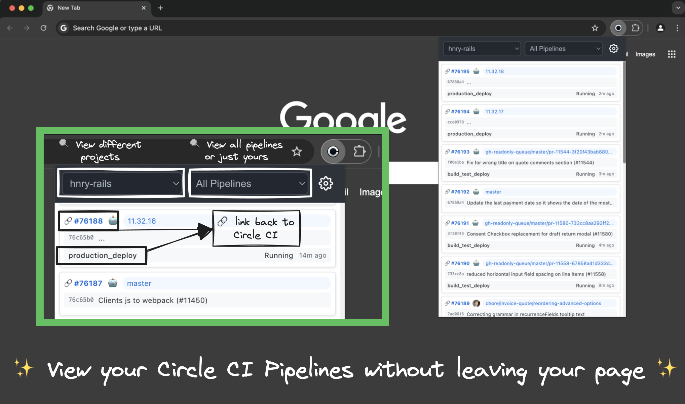
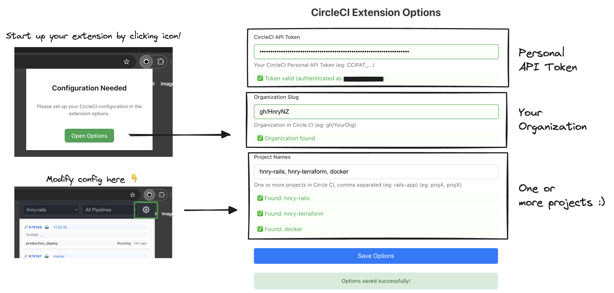

# CI Sidebar Extension

Monitor your CircleCI pipelines directly from your browser's sidebar!

Extension link: https://chromewebstore.google.com/detail/ci-popup-view/ffhlghceokkclmmpljpnjcnaecpabdll

<div align="center">
  
</div>

## Features

- 🔄 Real-time monitoring of running CircleCI pipelines
- 📊 View project-specific pipelines
- 👤 Track your own pipeline executions
- ⚙️ Customizable configuration through options page

## Installation

### Published Extension

Extension link: https://chromewebstore.google.com/detail/ci-popup-view/ffhlghceokkclmmpljpnjcnaecpabdll

### Local Installation

1. Clone this repository:
```bash
git clone https://github.com/yourusername/cci-sidebar-extension.git
```

2. Build the extension:
```bash
npm install
npm run build
```

3. Load the extension in Chrome:
   - Open Chrome and navigate to `chrome://extensions/`
   - Enable "Developer mode" in the top right
   - Click "Load unpacked" and select the `dist` directory

## Configuration

1. Click the extension icon in your Chrome toolbar
2. Navigate to the options page through the gear icon (or "Open Options" button)
3. Enter your:
   - CircleCI API Token (generate one at [CircleCI User Settings](https://app.circleci.com/settings/user/tokens))
   - Organization name
   - Project name(s)

<div align="center">
  
</div>


## Development

This extension is built with:
- React + TypeScript
- Vite
- Chrome Extension APIs

To start development:

```bash
npm install
npm run dev
```

The development server will start, and you can load the unpacked extension from the `dist` directory.

### Project Structure

- `src/` - Source code
  - `components/` - React components
  - `services/` - API and storage services
  - `hooks/` - Custom React hooks
  - `types/` - TypeScript type definitions
- `public/` - Static assets and manifest

## Contributing

Contributions are welcome! Here's how you can help:

1. Fork the repository
2. Create a feature branch (`git checkout -b feature/amazing-feature`)
3. Commit your changes (`git commit -m 'Add amazing feature'`)
4. Push to the branch (`git push origin feature/amazing-feature`)
5. Open a Pull Request

Please ensure your PR:
- Follows the existing code style
- Updates documentation as needed

## License

This project is licensed under the MIT License - see the [LICENSE](LICENSE) file for details.

## Acknowledgments

- Built with [CircleCI API](https://circleci.com/docs/api/v2/)
- Created using [Vite](https://vitejs.dev/)
